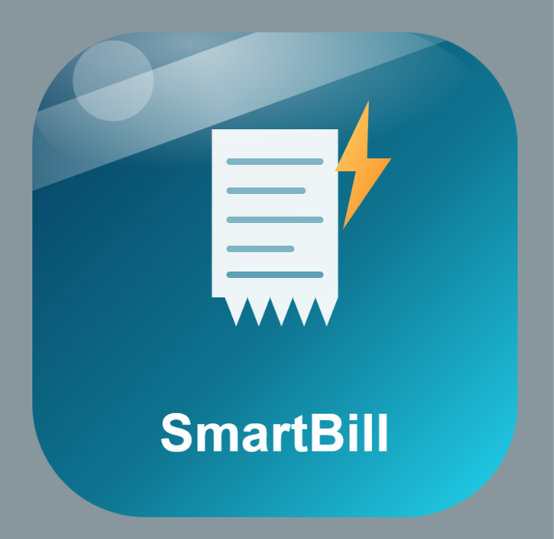

<div align="center">

  

  # ⚡ SmartBill

  **Next-Generation AI Vision Billing, Inventory & Khata Ledger System**

  *Designed for high-speed retail counters, grocery stores, supermarkets, and stationery shops.*

  [](https://developer.android.com/)
  [](https://kotlinlang.org/)
  [](https://developer.android.com/jetpack/compose)
  [](https://fastapi.tiangolo.com/)
  [](https://python.org/)
  [](https://developer.android.com/training/data-storage/room)
  [](LICENSE)

  <br/>

  <a href="release/SmartBill-v1.0.0.apk">
    
  </a>

</div>

---

## 📖 Overview

**SmartBill** is an all-in-one counter billing and retail management solution. It pairs a **native, offline-first Android application** with a **scalable FastAPI cloud synchronization backend**. Built specifically for retail environments where speed and reliability are paramount, SmartBill combines **illumination-resilient computer vision** for item recognition, dynamic UPI payment QR generation, customer credit (Khata) management, real-time sales reporting, and full support for 8 regional languages.

---

## 🌟 Key Features

### 👁️ Illumination-Invariant AI Vision Recognition
- **Dynamic Gain Normalization**: Automatically normalizes sensor RGB readings against ambient lighting levels, neutralizing glare, low-light dimness, and harsh shadows.
- **Adaptive Sobel Edge Threshold**: Edge extraction adapts dynamically to scene contrast.
- **Multi-Exposure Angle Embeddings**: Captures training angles with synthetic low-light ($0.65\times$) and bright-light ($1.40\times$) variations to ensure reliable detection under any room condition.

### ⚡ Rapid Counter Billing & Cart
- Instant barcode scanning via **Google ML Kit**.
- Visual detection with one-tap cart addition.
- Fast category filtering, real-time subtotal/tax calculation, and multi-mode checkout (Cash, UPI QR, Khata/Credit).
- Dynamic UPI QR code generation via **ZXing** for zero-contact customer payments.

### 📜 Historical Bills & Itemized Digital Receipts
- Dedicated **Previous Bills** screen with search by Bill Number or customer phone number.
- Filter bills by payment mode (Cash, UPI, Khata).
- Detailed receipt view modal with line-by-line item breakdown, quantities, rates, and tax.
- One-tap receipt sharing directly via **WhatsApp**, SMS, or Bluetooth thermal printers.

### 🌐 App-Wide Multilingual Experience
- Real-time language switcher supporting **8 languages**:
  - **English**, **हिंदी (Hindi)**, **தமிழ் (Tamil)**, **తెలుగు (Telugu)**, **ಕನ್ನಡ (Kannada)**, **मराठी (Marathi)**, **ગુજરાતી (Gujarati)**, **বাংলা (Bengali)**.
- Instant locale updates across all UI elements, dashboards, and dialogues without losing cart or form state.

### 🍫 Comprehensive Starter Inventory Catalog
- Pre-loaded with dozens of popular Indian retail items across:
  - **Chocolates**: Cadbury Dairy Milk, Silk, KitKat, Munch, 5 Star, Perk, Snickers, Amul Dark.
  - **Biscuits**: Parle-G, Marie Gold, Dark Fantasy, Hide & Seek, Bourbon, Tiger, Monaco, Krackjack, Jim Jam.
  - **Stationery & Notebooks**: Classmate Long/Spiral/Drawing books, Reynolds, Cello Butterflow, Pentonic, Hauser XO, Pilot V5, Apsara Pencils, Erasers, Geometry Box, Fevicol, Stapler, A4 Paper.
  - **Daily Groceries**: Rice, Atta, Toor Dal, Sunflower Oil, Sugar, Salt, Spices.
- **One-Tap Catalog Import**: Shopkeepers can import standard inventory items instantly with preconfigured retail prices and barcodes.

### 📒 Customer Khata (Credit Ledger)
- Digital ledger for customer credit management.
- Real-time customer balance calculation.
- Track individual credit transactions and log repayments with automatic receipt generation.

### 📊 Real-Time Reports & Business Analytics
- Live revenue KPI cards (Total Sales, Total Orders, Average Order Value).
- Payment method breakdown charts.
- Top-selling product leaderboard.
- Low-stock alerts and inventory valuation.

### 💾 Persistent Credentials & Offline-First Sync
- Automatic credential persistence across app restarts and resets.
- Complete offline capability: billing, scanning, and khata work 100% offline using Room SQLite.
- Background sync engine that reconciles changes with the cloud PostgreSQL database once internet connectivity is detected.

---

## 📂 Repository Structure

```
smart-bill/
├── .github/                     # Issue templates and workflows
├── android/                     # Native Android application (Kotlin + Compose)
│   ├── app/
│   │   ├── src/main/
│   │   │   ├── assets/          # Starter catalog (groceries, biscuits, chocolates, stationery)
│   │   │   ├── java/com/grocer/billing/
│   │   │   │   ├── core/        # Room DB, Vision Embedder, Localization, Network
│   │   │   │   ├── feature/     # Auth, Billing, Inventory, Khata, Reports, Settings
│   │   │   │   └── ui/theme/    # Material 3 colors, typography, shapes
│   │   │   └── res/             # Launcher icons, drawables, strings
│   │   └── build.gradle.kts
│   ├── gradle/
│   ├── gradlew.bat
│   └── README.md                # Android setup and build instructions
├── backend/                     # Cloud synchronization backend (FastAPI)
│   ├── app/
│   │   ├── api/v1/              # Endpoints (auth, shop, items, billing, sync)
│   │   ├── core/                # JWT security, password hashing
│   │   ├── db/                  # SQLAlchemy models and session engine
│   │   ├── schemas/             # Pydantic data validation
│   │   ├── config.py            # Environment configuration (SQLite / PostgreSQL)
│   │   └── main.py              # FastAPI application entrypoint
│   ├── tests/                   # Pytest automated test suite
│   ├── requirements.txt         # Python dependencies
│   └── README.md                # Backend setup guide
├── assets/                      # App logos, promotional graphics, icons
│   └── logo.png
├── release/                     # Pre-built APK releases
│   ├── SmartBill-v1.0.0.apk     # Ready-to-install Android package
│   └── README.md                # Release notes and SHA-256 checksums
├── .gitignore                   # Clean git exclusion rules
├── LICENSE                      # MIT License
└── README.md                    # Main project documentation
```

---

## 📱 Quick Download & Installation

The latest production-ready Android APK is available in the [`release/`](./release/) directory:

- **Download**: [`SmartBill-v1.0.0.apk`](release/SmartBill-v1.0.0.apk) (~35.5 MB)
- **SHA-256 Checksum**: `F08359BEEF0B42773DA3CFDAFA9A1307183AABBB0A173C1A1F682B505A876953`
- **Supported Android Versions**: Android 8.0 (Oreo / API 26) through Android 14 (API 34)

---

## 🚀 Development & Setup

### 1. Android Client Setup

1. Open the `android/` directory in **Android Studio** (Iguana 2023.2.1 or newer).
2. Allow Gradle to sync dependencies.
3. Connect an Android device with USB Debugging enabled or start an emulator.
4. Run the app:
   - Via Android Studio: Click **Run 'app'** (`Shift + F10`).
   - Via Command Line:
     ```bash
     cd android
     .\gradlew.bat assembleDebug
     ```

### 2. FastAPI Backend Setup

1. Navigate to the `backend/` directory:
   ```bash
   cd backend
   ```
2. Create and activate a virtual environment:
   ```bash
   python -m venv venv
   # Windows:
   venv\Scripts\activate
   # macOS/Linux:
   source venv/bin/activate
   ```
3. Install dependencies:
   ```bash
   pip install -r requirements.txt
   ```
4. Start the server:
   ```bash
   uvicorn app.main:app --reload --host 0.0.0.0 --port 8000
   ```
5. View interactive API docs at `http://localhost:8000/docs`.

---

## 🧪 Testing

### Android Unit Tests
```bash
cd android
.\gradlew.bat testDebugUnitTest
```

### Backend Integration Tests
```bash
cd backend
pytest
```

---

## 🛡️ License

This project is licensed under the [MIT License](LICENSE).
